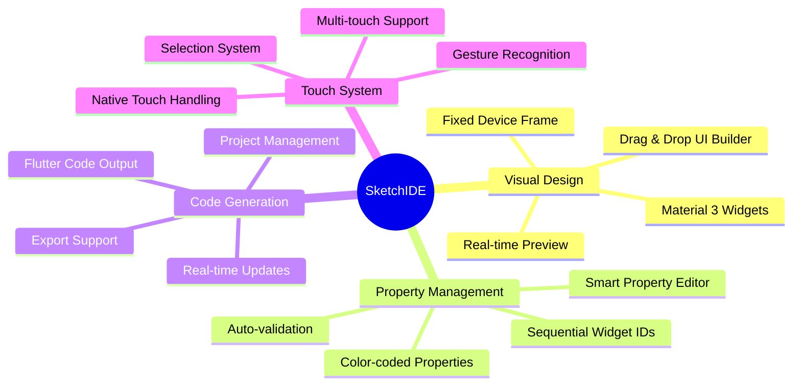
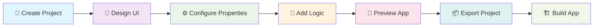
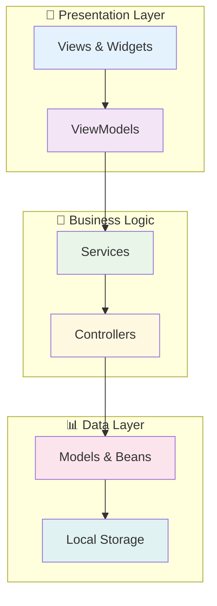

<p align="center">
  
</p>

# 🎨 SketchIDE

<p align="center">
  
  
  <a href="https://t.me/sketchidegroup">
    
  </a>
  <a href="https://t.me/sketchide">
    
  </a>
  
  
</p>

> ⚠️ **PROTOTYPE STATUS**: SketchIDE is currently in active development as a prototype. This is not a production release and is intended for testing, feedback, and development purposes only.

**SketchIDE** is a visual mobile IDE that enables anyone to build **native Android & iOS applications** through an intuitive drag-and-drop interface. Built with **Flutter** for modern cross-platform development, SketchIDE makes app creation accessible without requiring coding knowledge.

---

## ✨ Core Capabilities



### 🎯 **Visual Editor Features**
- **Intuitive Drag & Drop Interface** with smooth animations
- **Fixed Mobile Device Frame** (360x640dp) for consistent design
- **Property Panel** with slide-up animation and visual feedback
- **Smart Widget Management** with auto-selection and validation
- **Real-time Visual Feedback** during design operations

### 🔧 **Development Features**
- **Live Flutter Code Generation** from visual components
- **Sequential Widget Naming** (text1, text2, text3, etc.)
- **Project File Management** with organized structure
- **Cross-platform Output** supporting Android and iOS
- **Offline Development** with local project storage

### 🎨 **Property System**
- **Color-coded Property Types**: Text (Blue), Size (Green), Color (Purple), Number (Orange)
- **Smart Property Validation** with real-time error feedback
- **Comprehensive Widget Properties** for complete customization
- **Visual Property Editor** with intuitive controls

---

## 🚀 Current Development Status

<table>
<tr>
<td width="50%">

### ✅ **Implemented Features**
- [x] Visual drag & drop UI builder
- [x] Mobile device frame (360x640dp)
- [x] Property panel with animations
- [x] Touch controller system
- [x] Widget validation service
- [x] Flutter code generation
- [x] Project management
- [x] Frame widget system
- [x] Selection and feedback system

</td>
<td width="50%">

### 🔄 **In Development**
- [ ] Block-based logic editor
- [ ] Advanced widget templates
- [ ] Cloud build integration
- [ ] Plugin system
- [ ] Import/Export functionality
- [ ] Advanced animations
- [ ] Custom component library
- [ ] Multi-screen support

</td>
</tr>
</table>

---

## 📱 App Development Workflow



### Development Process
1. **Project Setup**: Create new project with basic Flutter structure
2. **Visual Design**: Use drag & drop to build UI with widgets
3. **Property Configuration**: Customize widget properties using visual editor
4. **Logic Integration**: Add interactive behavior (coming soon)
5. **Live Preview**: See changes in real-time mobile frame
6. **Export & Build**: Generate Flutter project for compilation

---

## 🏗️ Architecture Overview



### **MVVM Architecture Pattern**
- **Models**: Data structures and business entities
- **Views**: UI screens and user interfaces  
- **ViewModels**: Business logic and state management
- **Services**: Core functionality and API communication
- **Controllers**: Touch handling and user interactions

---

## 📊 Feature Matrix

| Feature Category | Implementation Status | Description |
|-----------------|---------------------|-------------|
| 🎨 **Visual Editor** | ✅ **Complete** | Drag & drop interface with mobile frame |
| 🔧 **Property System** | ✅ **Complete** | Color-coded property editor with validation |
| 📱 **Touch System** | ✅ **Complete** | Native-like touch handling and gestures |
| 💾 **Code Generation** | ✅ **Complete** | Real-time Flutter code output |
| 🎯 **Widget System** | ✅ **Complete** | Full widget palette with frame components |
| 📦 **Project Management** | ✅ **Complete** | Local project storage and organization |
| 🧩 **Logic Editor** | 🔄 **In Progress** | Block-based programming interface |
| ☁️ **Cloud Integration** | 📅 **Planned** | Cloud build and deployment |

---

## 🛠️ Development Setup

### Prerequisites
- Flutter SDK (latest stable)
- Dart SDK (included with Flutter)
- Android Studio / VS Code
- Git

### Quick Start
```bash
# Clone the repository
git clone https://github.com/sketchide/SketchIDE.git

# Navigate to project directory
cd SketchIDE

# Install dependencies
flutter pub get

# Run the application
flutter run
```

### Project Structure
```
SketchIDE/
├── lib/
│   ├── controllers/        # Touch & interaction handling
│   ├── models/            # Data structures
│   ├── services/          # Business logic services
│   ├── viewmodels/        # MVVM view models
│   ├── views/             # UI screens
│   └── widgets/           # Reusable UI components
├── assets/                # Images, icons, templates
└── android/ios/          # Platform-specific files
```

---

## 🤝 Contributing to the Prototype

We welcome contributions to help improve SketchIDE! Since this is a prototype, we're especially interested in:

### 🎯 **Priority Areas**
- **UI/UX Improvements**: Enhance the visual design experience
- **Performance Optimization**: Improve rendering and responsiveness  
- **Feature Testing**: Help identify bugs and edge cases
- **Documentation**: Improve code documentation and user guides

### 📝 **Contribution Guidelines**
1. Fork the repository and create a feature branch
2. Follow the existing code style and architecture patterns
3. Add appropriate tests for new functionality
4. Submit pull requests with clear descriptions
5. Participate in code reviews and feedback

### 🏷️ **Commit Convention**
```
feat: add new widget to palette
fix: resolve touch handling issue
design: improve property panel UI
test: add unit tests for validation
docs: update README with new features
```

---

## ⚠️ Prototype Disclaimer

**Important Notice**: SketchIDE is currently a **prototype in active development**. 

### What This Means:
- 🔧 **Features may change** without notice during development
- 🐛 **Bugs and issues** are expected and being actively addressed
- 📱 **Not ready for production** app development
- 🔄 **Frequent updates** and changes to the codebase
- 💬 **Feedback is crucial** for improving the final product

### Testing & Feedback:
- Test the visual editor and report any issues
- Suggest improvements for user experience
- Help identify missing features or functionality
- Provide feedback on performance and stability

---

## 📞 Community & Support

<p align="center">
  <a href="https://t.me/sketchidegroup">
    
  </a>
  <a href="https://t.me/sketchide">
    
  </a>
</p>

- **Community Discussion**: [Telegram Group](https://t.me/sketchidegroup)
- **Updates & News**: [Telegram Channel](https://t.me/sketchide)
- **Email Support**: [developerrajendrahelp@gmail.com](mailto:developerrajendrahelp@gmail.com)

---

## 📄 License

SketchIDE is open source software licensed under the **MIT License**.

```
MIT License - Free to use, modify, and distribute
```

This prototype is provided "as-is" for development and testing purposes. See [LICENSE](LICENSE) for full details.

---

<p align="center">
  
  <br>
  <strong>🚀 Building the future of visual app development 🚀</strong>
</p>
