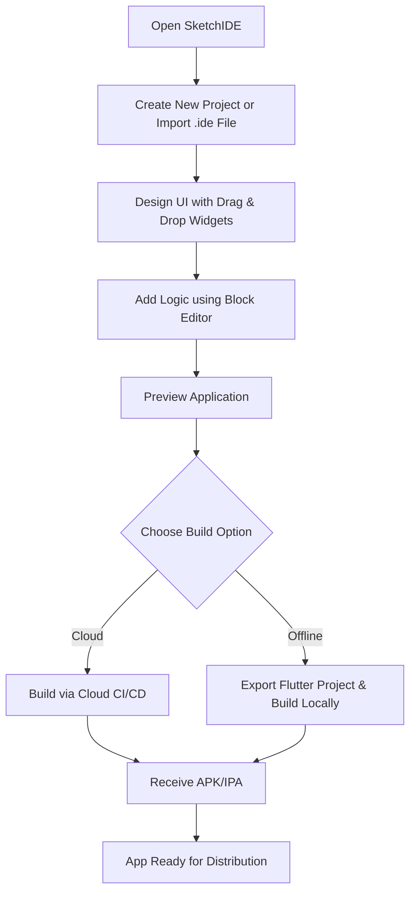
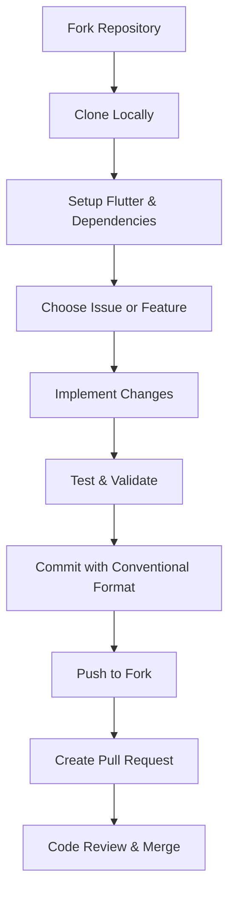

<p align="center">
  
</p>

# 📊 SketchIDE

<p align="center">
  <a href="https://t.me/sketchidegroup">
    
  </a>
  <a href="https://t.me/sketchide">
    
  </a>
  
  
  
  
</p>

**SketchIDE** is an offline mobile IDE that allows anyone to build **native Android & iOS apps visually** – no coding required. Inspired by Sketchware Pro but built using **Flutter** for modern, cross-platform compatibility.

---

## 🌟 Core Features

* **Block-based Visual Programming** (logic without typing code)
* **Drag-and-Drop UI Builder** with Material 3 widgets
* **Project Export** in `.ide` format (like Sketchware `.swb`)
* **Code Preview & Editor** (for advanced users)
* **Offline Builds**

  * **Option 1:** Export Flutter project → Build locally with Android Studio/Xcode
  * **Option 2:** Cloud CI/CD build (Codemagic / GitHub Actions)
* **Scoped Storage Compliant** (projects stored in sandbox)
* **Cross‑platform Output:** Android (APK/AAB) & iOS (IPA)
* **Plugin System** for custom components and blocks

---

## 📱 How Users Create Apps in SketchIDE



---

## 🐽 Roadmap

* [x] Create project
* [ ] UI Canvas with drag & drop
* [ ] Logic block editor (Blockly)
* [ ] Project import/export (`.ide`)
* [ ] Android offline APK builder
* [ ] iOS Xcode project exporter
* [ ] Custom widget templates
* [ ] Marketplace for templates

---

## Folder Structure

```bash
SketchIDE/
├── lib/
│   ├── core/                # Constants, utils, error handling
│   ├── data/                # Hive/SQLite models and persistence
│   ├── features/
│   │   ├── project/         # Project create/edit/export
│   │   ├── builder/         # UI drag & drop editor
│   │   ├── blocks/          # Visual programming engine
│   │   ├── preview/         # Live preview renderer
│   │   ├── settings/        # App settings & theme
│   │   └── cloud_build/     # CI/CD integration
│   └── main.dart            # Entry point
├── assets/                  # Icons, templates
├── export_templates/        # Flutter boilerplate
└── fastlane/                # Play Store metadata
```

---

## 🧰 Contributor Workflow



### Roles

* **UI Builder Team**: Drag & drop widgets
* **Block Editor Team**: Logic block engine
* **Build/Export Team**: Android & iOS build pipeline
* **Core System Team**: Database & project handling
* **QA Team**: Unit and widget testing

---

## 🤝 How to Contribute

1. **Fork** this repo
2. **Clone & Setup:** `flutter pub get`
3. **Pick an Issue** from GitHub Issues
4. **Develop & Test** locally
5. **Submit Pull Request** with description

#### Commit Types

* `feat:` new feature
* `fix:` bug fix
* `design:` UI/UX change
* `refactor:` internal improvements
* `test:` testing related
* `docs:` documentation

---

## ⚠️ Permissions & Guidelines

### **Storage Policy**
- Do **not** modify **Scoped Storage policies** (required for Google Play compliance).
- Avoid uninstalling the app **before upgrading** to prevent project loss.

### **Why Scoped Storage?**
- Google Play policies no longer allow unrestricted file access.
- **SketchIDE** follows these rules to ensure app stability and compliance.

### **How SketchIDE Handles Files**
- Projects are stored securely in the **App Sandbox**:  
  `/Android/data/com.sketchide.app/files/projects`
- **Export/Import** uses **SAF (Storage Access Framework)** for safe file handling.

### **Benefits**
- No risk of Play Store rejection.
- Secure and future-proof file storage.
- Easy **backup** and **restore** process.

---

## 📢 Support & Feedback

* **Telegram Group:** [Join](https://t.me/sketchidegroup)
* **Telegram Channel:** [Updates](https://t.me/sketchide)
* **Email:** [developerrajendrahelp@gmail.com](mailto:developerrajendrahelp@gmail.com)

---

## 🎉 License

SketchIDE is licensed under **MIT** and **CC BY 4.0**.

```text
SketchIDE is free software: you can redistribute it and/or modify it under the terms of both the MIT License and the Creative Commons Attribution 4.0 International License (CC BY 4.0).

It is distributed in the hope that it will be useful, but WITHOUT ANY WARRANTY; without even the implied warranty of MERCHANTABILITY or FITNESS FOR A PARTICULAR PURPOSE.
```

View licenses: [MIT](https://opensource.org/licenses/MIT) | [CC BY 4.0](https://creativecommons.org/licenses/by/4.0/)

---

**🎉 Happy Coding with SketchIDE! 🎉**
