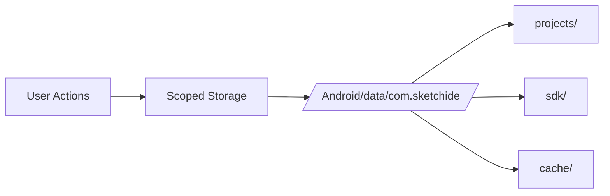
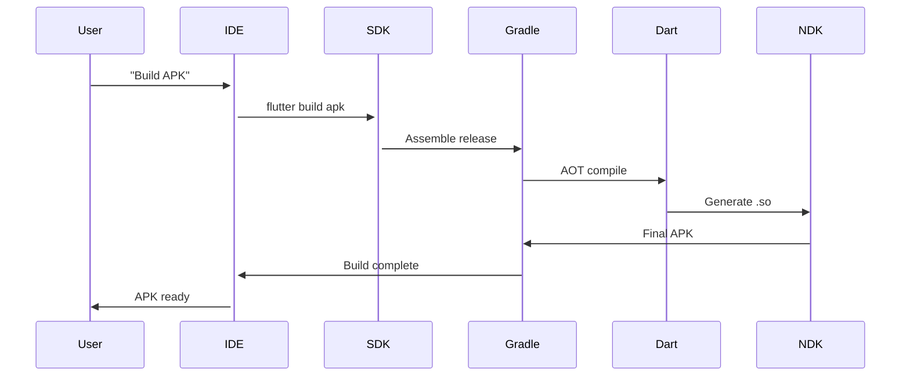

## 📚 SketchIDE Technical Documentation

This document explains the **frameworks**, **features**, **storage structure**, **offline SDK handling**, and **default behavior** of projects created with **SketchIDE**.

---

## **1. Frameworks Used**

### **Frontend**

- **Flutter (Dart)** → Cross-platform mobile app development (Android \& iOS)
- **Material Design Components** → Consistent UI/UX design
- **Scoped Storage (SAF)** → Google Play compliant file handling


### **Backend (Local Data Handling)**

- **Hive DB** →
    - Used for **project metadata** \& **quick access cache**
    - No native dependencies → fast \& lightweight
- **SQLite** →
    - Used for **structured project configurations**, version control of UI/logic
    - Ideal for storing complex relational data


### **Build System**

- **Gradle (Android)** → For compiling APK and AAB
- **Xcode (iOS)** → For generating IPA (macOS only)
- **Dart/Flutter Build Pipeline** → Converts Flutter code to platform binaries

---

## **2. Features Implemented**

### **Core Features**

1. **Project Creation**
    - App name, package name, icon, default Dart structure
2. **UI/Logic Visual Editor**
    - Layout builder (JSON-based)
    - Block programming for app logic
3. **Project Management**
    - Edit project settings
    - Delete project
    - Export project (source) / Export \& Sign (build)
4. **Search \& Filter**
    - Quick project lookup
5. **UI**
    - Drawer navigation
    - Floating action button for creating projects
    - Project list with icons and metadata

### **Storage Compliance**

- Uses **Scoped Storage** → All files saved inside the app sandbox
- SAF for **import/export** operations

---

## **3. Offline SDK Integration**

### **Why Offline?**

- Many users work without stable internet.
- Avoids cloud dependency for builds.
- Provides instant preview and offline APK build.

---

### **3.1 SDK Components**

Minimum required for offline Flutter build:

1. **Flutter Engine (C++)** → ~500 MB (ARMv7 + ARM64 only)
2. **Dart SDK (JIT + AOT)** → ~200 MB
3. **Gradle + Android Build Tools (minimal)** → ~300 MB
4. **Pre-bundled pub cache (basic Flutter packages)** → ~50 MB

**Total after optimization:** **~800 MB – 1 GB**

---

### **3.2 SDK Storage Path**

Stored in app’s sandbox:

```plaintext
/Android/data/com.sketchide.app/files/sdk/
├── flutter_engine/         # Flutter engine binaries
├── dart_sdk/               # Dart SDK (JIT & AOT)
├── gradle/                 # Minimal Gradle wrapper & cache
├── pub_cache/              # Default packages
└── version.json            # SDK version mapping

```
### **Storage Compliance**


# 📚 SketchIDE Technical Documentation

This document explains the **frameworks**, **features**, **storage structure**, **offline SDK integration and handling**, and **default behavior** of projects created with **SketchIDE**.

---

## **1. Frameworks Used**

### **Frontend**
- **Flutter (Dart)**  
  → Cross-platform mobile app development (Android & iOS)
- **Material Design Components**  
  → Consistent UI/UX design
- **Scoped Storage (SAF)**  
  → Google Play-compliant file handling

### **Backend (Local Data Handling)**
- **Hive DB**  
  - Used for **project metadata** & **quick access cache**  
  - No native dependencies → fast & lightweight
- **SQLite**  
  - Used for **structured project configurations**, version control of UI/logic  
  - Ideal for storing complex relational data

### **Build System**
- **Gradle (Android)**  
  → For compiling APK and AAB
- **Xcode (iOS)**  
  → For generating IPA (macOS only)
- **Dart/Flutter Build Pipeline**  
  → Converts Flutter code to platform binaries

---

## **2. Features Implemented**

### **Core Features**
1. **Project Creation**
   - App name, package name, icon, default Dart structure
2. **UI/Logic Visual Editor**
   - Layout builder (JSON-based)
   - Block programming for app logic
3. **Project Management**
   - Edit project settings
   - Delete project
   - Export project (source) / Export & Sign (build)
4. **Search & Filter**
   - Quick project lookup
5. **UI**
   - Drawer navigation
   - Floating action button for creating projects
   - Project list with icons and metadata

### **Storage Compliance**
- Uses **Scoped Storage** → All files saved inside the app sandbox  
- **SAF** for import/export operations

---

## **3. Offline SDK Integration**

### **Why Offline?**
- Many users work without stable internet.
- Avoids cloud dependency for builds.
- Provides instant preview and offline APK build.

### **3.1 SDK Components**
Minimum required for offline Flutter build:

| Component                              | Description                                       | Size (approx.) |
|-----------------------------------------|---------------------------------------------------|----------------|
| **Flutter Engine (C++)**                | Precompiled for ARMv7 + ARM64                     | ~500 MB        |
| **Dart SDK (JIT + AOT)**                | Dart runtime and compilers                        | ~200 MB        |
| **Gradle + Android Build Tools (min.)** | Gradle wrapper, minimal build tools                | ~300 MB        |
| **Pre-bundled pub cache**               | Default basic Flutter packages                     | ~50 MB         |

> **Total optimized SDK size:** ~800 MB – 1 GB  
> (Significantly under the official SDK size, and fully portable/offline!)

### **3.2 SDK Storage Path**
SDK files are stored in the app’s sandbox for Google Play compliance:

```

/Android/data/com.sketchide.app/files/sdk/
├── flutter_engine/            \# Flutter engine binaries
├── dart_sdk/                  \# Dart SDK (JIT \& AOT)
├── gradle/                    \# Minimal Gradle wrapper \& cache
├── pub_cache/                 \# Default pub packages
└── version.json               \# SDK version info

```

*Example `version.json`:*
```

{
"flutter": "3.19.2",
"dart": "3.2.0",
"gradle": "8.4",
"buildTools": "34.0.0"
}

```

---

## **4. Offline SDK Workflow: Internal Preview System**

- **Challenge:**  
  The full SDK is several GB and not suitable for mobile embedding.
- **Solution:**  
  Core engine, Dart runtime, and templates bundled in an optimized, stripped SDK.
- **Preview System:**  
  - Runs in-app using **embeded Flutter Engine**
  - Uses **precompiled Dart-to-Kernel**, fast UI rendering
  - **No Internet required** for editing, preview, or local builds (APK)

---

## **5. Project Storage Structure**

All projects are stored within:

```

/Android/data/com.sketchide.app/files/projects/<projectId>/

```

### **Folder Tree Example**

```

<projectId>/
├── meta.json                 \# Project metadata
├── icon.png                  \# App icon
│
├── lib/                      \# Dart source
│   ├── main.dart
│   └── home_page.dart
│
├── ui/                       \# Layout JSON
│   └── main.json
│
├── logic/                    \# Block-programming logic
│   └── main_logic.json
│
├── assets/                   \# Project assets
│   ├── default_banner.png
│   └── example.png
│
├── android/                  \# Android-specific
│   ├── app/src/main/
│   │   ├── AndroidManifest.xml
│   │   ├── java/
│   │   ├── res/mipmap-*/ic_launcher.png
│   │   └── values/strings.xml
│   └── build.gradle
│
├── ios/                      \# iOS-specific
│   ├── Runner.xcodeproj/
│   ├── Runner/
│   │   ├── AppDelegate.swift
│   │   ├── Info.plist
│   │   └── Assets.xcassets/AppIcon.appiconset/
│   └── Podfile
│
├── pubspec.yaml              \# Flutter dependencies
└── build/                    \# Compiled output
├── android/app-release.apk
├── android/app-release.aab
└── ios/app-release.ipa

```

---

### **meta.json Example**

```

{
"appName": "MyApp",
"packageName": "com.example.myapp",
"version": "1.0.0",
"description": "Default app created using SketchIDE",
"created": "2025-07-25T10:30:00Z"
}

```

---

### **Default Generated `main.dart`**

```

import 'package:flutter/material.dart';
import 'home_page.dart';

void main() => runApp(const MyApp());

class MyApp extends StatelessWidget {
const MyApp({super.key});
@override
Widget build(BuildContext context) {
return MaterialApp(
title: 'MyApp',
theme: ThemeData(primarySwatch: Colors.blue),
home: const HomePage(),
);
}
}

```

---

### **Default Generated `home_page.dart`**

```

import 'package:flutter/material.dart';

class HomePage extends StatelessWidget {
const HomePage({super.key});

@override
Widget build(BuildContext context) {
return Scaffold(
appBar: AppBar(title: const Text('Home')),
body: const Center(child: Text('Welcome to MyApp')),
);
}
}

```

---

## **6. Data Storage Technologies: Hive + SQLite + JSON**

### **Rationale**
- **Hive:**  
  For fast app state and settings (project list, cache, app settings)
- **SQLite:**  
  Handles complex, relational UI trees, logic flow, and versioned data
- **JSON:**  
  Human-readable import/export and backup

### **SQLite Schema Example**

```

-- UI Table
CREATE TABLE ui_nodes (
id INTEGER PRIMARY KEY AUTOINCREMENT,
type TEXT NOT NULL,
properties TEXT NOT NULL,
parent_id INTEGER,
FOREIGN KEY(parent_id) REFERENCES ui_nodes(id)
);

-- Logic Table
CREATE TABLE logic_flows (
id INTEGER PRIMARY KEY AUTOINCREMENT,
event_name TEXT NOT NULL,
target_node INTEGER NOT NULL,
action TEXT NOT NULL,
FOREIGN KEY(target_node) REFERENCES ui_nodes(id)
);

```

### **Data Flow Example**

```

graph TD
Hive[Hive DB (project cache)]
SQLite[SQLite (UI/Logic)]
JSON[JSON (import/export)]
CustomSDK[Custom SDK (Offline/Preview)]
Hive -- updates/reads --> SQLite
SQLite -- backup/restore --> JSON
JSON -- supplies config --> CustomSDK

```

---

## **7. Project CRUD Operations**

- **Edit Project:**  
  Editing settings changes `meta.json`, may trigger regeneration of scaffold code/templates.
- **Delete Project:**  
  Removes entire folder from `/projects/<projectId>/`
- **Export:**  
  Zips content for external transfer; can trigger SAF for output
- **Sync:**  
  Updates across Hive (cache), SQLite (logic/UI), and JSON (backup/export)

---

## **8. Compliance**

- **Scoped Storage:**  
  All data limited to app sandbox for Google Play compliance
- **SAF:**  
  Secure access and export/import to other locations/outside apps
- **No unrestricted file access** or legacy storage; passes Play Store reviews

---

## **9. Appendix: Example `pubspec.yaml`**

```

name: myapp
description: Default app created using SketchIDE
version: 1.0.0
environment:
sdk: ">=3.0.0 <4.0.0"

dependencies:
flutter:
sdk: flutter
cupertino_icons: ^1.0.2

flutter:
assets:
- assets/default_banner.png
- assets/example.png

```

---

## **10. Extra: Roadmap Ideas**

- AI-powered UI and code suggestions
- Extension/plugin system for new platform builds (web, desktop)
- Templates and logic packs marketplace
- Cloud collaboration and team projects
- Real-device streaming & direct debugging

---

## **11. Quick Reference: Why Each Storage Layer?**

- **Hive:** Fast access, quick app state, project list, small app configs
- **SQLite:** Complex UI tree, logic flow, versioned relational data
- **JSON:** Portable, backup, export/import, human-readable

---

# **End of Document**


---

**Copy and use all of the above in your GitHub or documentation files.**
All previous and new information is now unified and ready for publishing. If you want further diagrams or want to expand the roadmap section, let me know!

